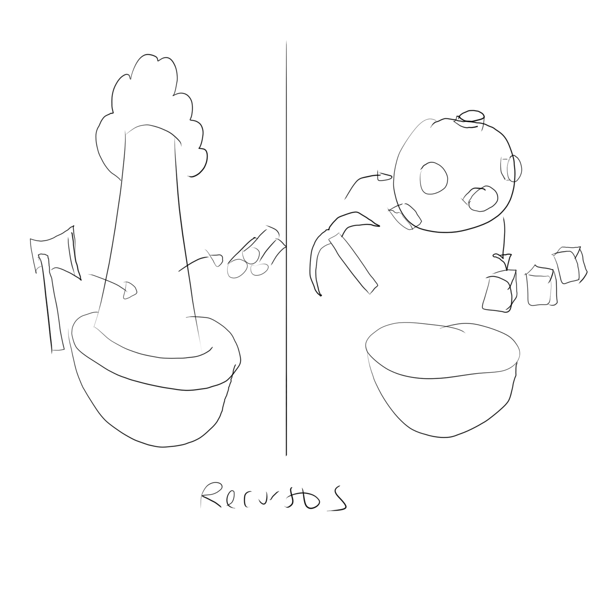

### Elementos del mapa

- **Aldeas**: Realizan peticiones al jugador. Si el jugador las completa, la aldea sube un nivel y la siguiente petición será más compleja, si no las completa a tiempo la aldea pierde una vida y la petición se reinicia.
>Idea: Las aldeas tienen una barra de vida que empieza con un valor inicial y van perdiendo parte con el tiempo (o con ataques de enemigos que el jugador debe aplastar). Completar peticiones aumenta la vida de la aldea y si se supera cierto valor la vida baja mucho mas despacio y no recibe ataques. El jugador gana si todas las aldeas han alcanzado ese umbral.

- **Puntos de recurso**: Determinados puntos del mapa que sirven para conseguir recursos con los que forjar las armas. Estos puntos tienen una cantidad limitada de usos y cuando se acaban el punto desaparece y aparece uno nuevo en otra parte del mapa. Puede haber varios puntos del mismo recurso a la vez.
Cuando el jugador elige un punto de recurso, lo trae automáticamente a una parte de su mesa de trabajo para trabajar con él.
Los tipos de puntos de recurso son bosques y minas.

 

---

### Estaciones

- **Manual**: Contiene toda la información necesaria para forjar armas (como obtener recursos, tabla de aleaciones, como usar las estaciones, etc.).
- **Cofre**: Lugar donde se guardan todos los recursos del jugador.
- **Recurso**: Permite usar un punto de recurso seleccionado en el mapa.
    - Si se selecciona un bosque, aparecera un arbol en la estación y el jugador tendrá que golpear el tronco del árbol varias veces hasta romperlo. Cuando complete el minijuego recibirá cierta cantidad de leña.
    - Si se selecciona una mina, aparecerá una cilindro de piedra con distintos metales incrustados, identificados por un color concreto. El cilindro girará sobre sí mismo y el jugador podrá picar el metal un número limitado de veces hasta que se rompa. Si golpea alguno de los metales incrustados recibirá ese metal, y si falla recibirá metales impuros.

- **Forja**: Sirve para fundir un metal. El jugador obtiene el mismo metal que funda pero en estado líquido.
- **Caldero**: Sirve para combinar varios metales y crear una aleación. Para usarla se eligen 2 o 3 metales fundidos. El jugador deberá remover la mezcla a una velocidad fija durante un tiempo determinado para obtener la aleación. Al terminar el jugador obtendra la aleación determinada. Si ha mezclado varios metales que no pueden formar una aleación obtendrá el objeto "aleación desconocida".
- **Molde**: Sirve para dar forma a un metal fundido o aleación, a partir de un molde construido con un bloque de piedra. El jugador debe escoger una de las plantillas disponibles y aparecerá una guía marcada encima del bloque de piedra. Después se debe recortar el bloque siguiendo la guía. Si lo consigue podra echar el metal en el molde, y si no tendrá que repetir el proceso.
- **Yunque**: Sirve para terminar las armas forjadas. El jugador deberá golpear con un martillo distintos puntos del arma con una fuerza y ángulo determinado. La precisión determinará la calidad del arma final (de 1 a 5 estrellas). Si no se consigue la calidad necesaria se podrá deshacer el proceso usando un martillo especial.
 
 
---

### Recursos

- **Leña**: Se obtiene de los bosques y sirve para encender la forja y poder fundir metales y crear aleaciones.
- **Metales**: Se obtienen de las minas y sirven para crear aleaciones y armas. 
- **Aleaciones**: Se obtienen de combinar dos o tres metales y sirven para crear armas.
- **Armas (sin acabar)**: Se obtiene de enfriar un metal en un molde.
- **Armas**: Sirven para completar peticiones de aldeas.

#### Metales

En el juego existen 6 metales base (divididos en 3 tiers),  2 elementos especiales y los metales impuros.

-	**Tier 1**: Cobre, estaño (6 aleaciones cada uno)
-	**Tier 2**: Hierro, Aluminio (5 aleaciones cada uno)
-	**Tier 3**: Plata, oro (4 aleaciones cada uno)
-	**Especiales**: Carbón y plomo (3 aleaciones cada uno)
-	**Metales impuros** (8 aleaciones).

#### Aleaciones

 ##### Aleaciones binarias

|         | Cobre     |Estaño        |Hierro  |Aluminio   |Plata       |Oro       |Plomo        |Carbón     |M. impuros    |
|----------|:------------:|:--------------:|:--------:|:-----------:|:------------:|:----------:|:-------------:|:-----------:|:--------------:|
|**Cobre**     |            |Bronce        |        |Duraluminio|Plata de ley|Oro rojo  |Peltre       |           |latón         |
|**Estaño**   |Bronce      |              |?     |?        |?         |          |Metal de rose|           |Metal de field|
|**Hierro**    |            |?           |        |           |            |Oro azul  |?          |Acero      |Vitalio       |
|**Aluminio**  |Duraluminio |?           |        |           |            |Oro verde |             |?        |Alnico        | 
|**Plata**     |Plata de ley|?           |        |           |            |          |             |Plata negra|?           |
|**Oro**      |Oro rojo    |              |Oro azul|Oro verde  |            |          |             |           |Oro blanco    |
|**Plomo**    |Peltre      |Metal de rose |?     |           |            |          |             |           |              | 
|**Carbón**    |            |              |Acero   |?        |Plata negra |          |             |           |              | 
|**M. impuros**|Latón       |Metal de field|Vitalio |Alnico     |?         |Oro blanco|             |           |              | 

> ?: Falta ponerles nombre

#### Armas

Existen distintos tipos de armas que las aldeas pueden pedir. El tipo de arma únicamente define la forma que se le debe dar a la pieza de metal que se use para forjarla (espadas, hachas, escudos, lanzas, etc.). 
Cada arma se identifica por un tipo o forma, un metal o aleación con el que se construye y una calidad mínima.

