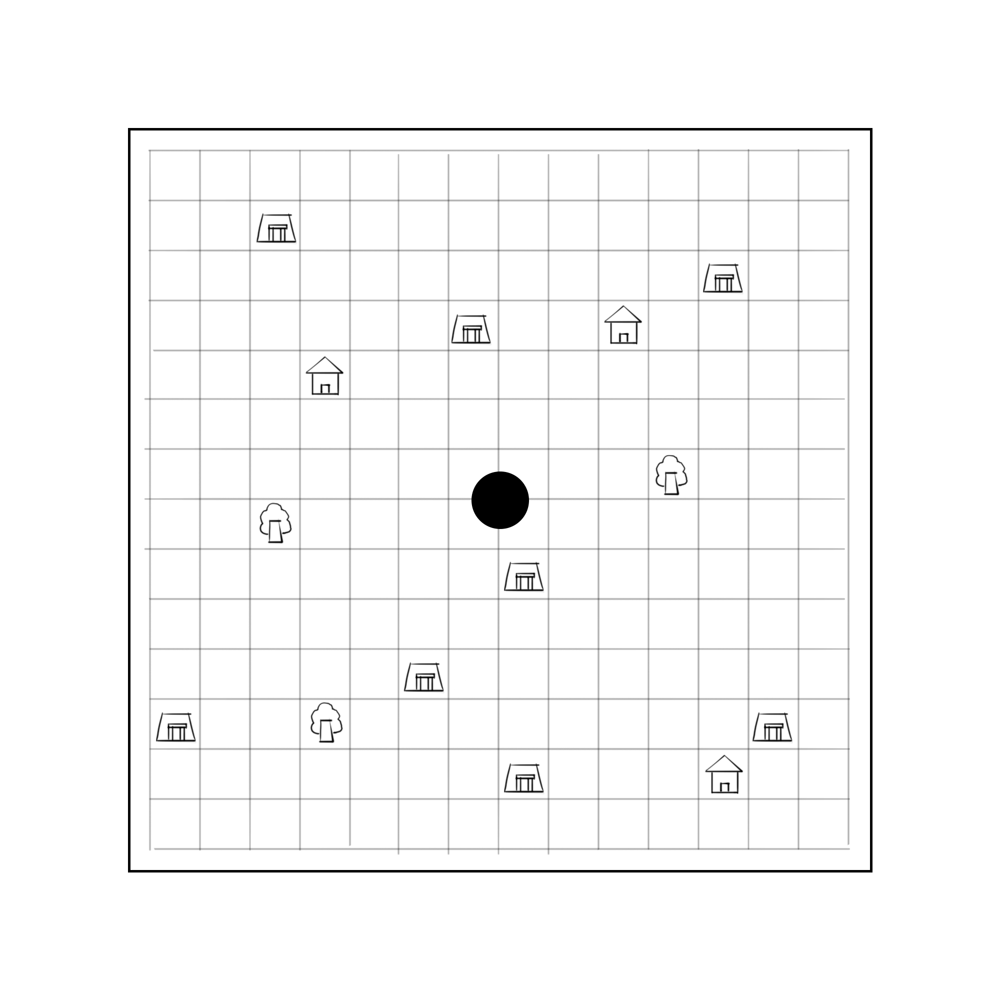
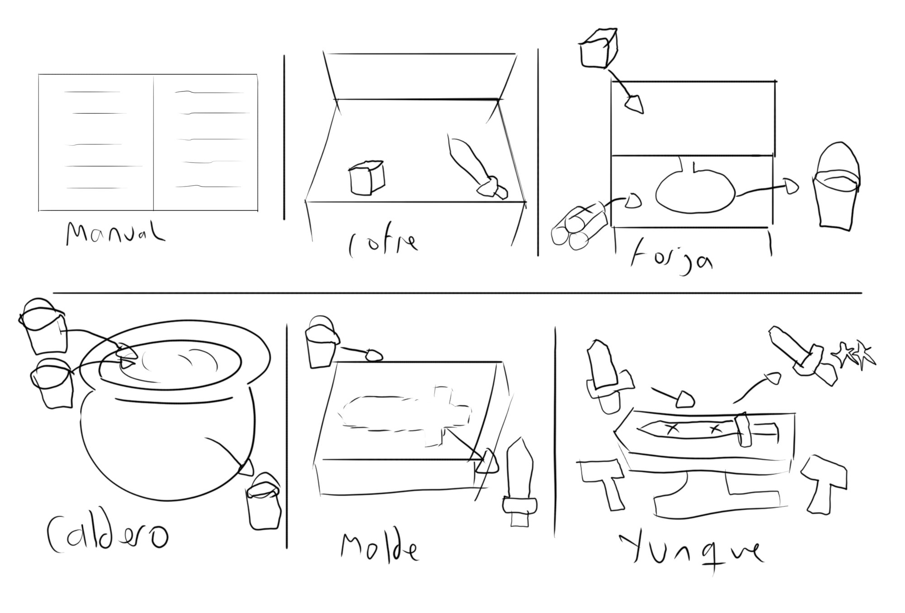

### Elementos del mapa

- **Aldeas**: Realizan peticiones al jugador. Si el jugador las completa, la aldea sube un nivel y la siguiente petición será más compleja, si no las completa a tiempo la aldea pierde una vida y la petición se reinicia.
>Idea: Las aldeas tienen una barra de vida que empieza con un valor inicial y van perdiendo parte con el tiempo (o con ataques de enemigos que el jugador debe aplastar). Completar peticiones aumenta la vida de la aldea y si se supera cierto valor la vida baja mucho mas despacio y no recibe ataques. El jugador gana si todas las aldeas han alcanzado ese umbral.

- **Puntos de recurso**: Determinados puntos del mapa que sirven para conseguir recursos con los que forjar las armas. Estos puntos tienen una cantidad limitada de usos y cuando se acaban el punto desaparece y aparece uno nuevo en otra parte del mapa. Puede haber varios puntos del mismo recurso a la vez.
Cuando el jugador elige un punto de recurso, lo trae automáticamente a una parte de su mesa de trabajo para trabajar con él.
Los tipos de puntos de recurso son bosques y minas.

 

### Cosas generales de VR:

- InteractionLayers: Cada *Interactor* o *Interactable* puede tener una o varias capas de interacción, para determinar como interactuan entre sí. Si un *Interactor* solo tiene la capa x, solo podrá interactuar con *Interactables* con la capa X. Se usa para distinguir la interacción a distancia (*RayInteractors*) y directa, y para las *SnapZones*.

- SnapZone: Objeto de la escena que sirve para dejar *GrabInteractors* anclados a ellos. Funcionan con la clase *XRSocketInteractor*. Puedes definir que tipo de objetos se pueden guardar usando *InteractionLayers*. En el juego se definen 4: ore (minerales y madera), ingot (lingotes), tools (herramientas como el pico, el hacha o el martillo) y weapons (armas). También incluyen eventos para cuando un *GrabInteractable* entra o sale de su collider o cuando se quita o pone un *GrabInteractable* dentro. En concreto se han usado estos dos últimos para guardar información sobre los objetos guardados, ya que los eventos incluyen parámetros con esta información. 

- Botones: Son *Interactables* simples que invocan un evento cuando un *DirectInteractor* entra dentro de su collider. Se puede hacer que se ejecute cualquier función (sin parámetros) cuando se llama a estos eventos usando el editor.

- Palancas: Son *GrabInteractables* que incluyen un componente de tipo *Joint*. Los componentes de tipo *Joint* permiten limitar el movimiento de los objetos de ciertas formas (rotación, translación, etc.).

> ------------------------------------- [NUEVO] ---------------------------------
### Nube

### Manual (No implementada) 

Contiene toda la información necesaria para forjar armas (como obtener recursos, tabla de aleaciones, como usar las estaciones, etc.).

### Recursos: Permite usar un punto de recurso seleccionado en el mapa.

 - Si se selecciona un bosque, aparecera un arbol en la estación y el jugador tendrá que golpear el tronco del árbol varias veces a distintas alturas. cada golpe generará 1 de madera.
 - Si se selecciona una mina, aparecerá una piedra con distintos metales incrustados, identificados por un color concreto. La piedra girará sobre sí misma y el jugador podrá usar el pico para golpear la piedra. Si golpea con suficiente fuerza generará minerales. Golpear los minerales incrustados generará el metal correspondiente (destruyendo el mineral) y golpear la piedra generará metal impuro (con un cooldown).

 

### Cofre

Lugar donde se guardan todos los recursos del jugador.
Permite guardar recursos usando SnapZones. Se divide en 4 secciones que se pueden girar usando las *Palancas* de los laterales.
Cada sección tiene 2 partes, en una se pueden guardar metales y en otra armas.

### Estaciones

Una sección de la nube es el sistema de estaciones. Cuenta con 4 estaciones que se pueden activar y desactivar usando los 4 **botones**.

---

#### FORJA

Sirve para conseguir lingotes de metal a partir de minerales.

En la parte superior hay 3 **SnapZones** en las que se colocan minerales de metal. En la parte inferior hay una **SnapZone** en la que si se coloca madera aumenta el combustible de la forja en 1, hasta un máximo de 10.
Al pulsar el **botón**, si hay al menos 1 de combustible, se iniciará una animación y al acabar los metales introducidos se destruirán, sustituyendose por su equivalente en lingote. 

---

#### CALDERO

Sirve para conseguir aleaciones.

Tiene 2 **SnapZones** en las que se pueden introducir lingotes. Al pulsar el **botón**, se comprobará si existe una aleación de esos dos metales, y si existe se destruirán y se generará un lingote de la aleación correspondiente.

*(Falta jugabilidad de remover el caldero)*

---

#### MOLDE

Sirve para conseguir armas de nivel 0 (no sirven para las peticiones).

Tiene 2 **botones**. El primero sirve para cambiar la plantilla del molde (hay 5 plantillas una por cada arma). La segunda sirve para generar el arma o resetear el molde si la estación no tiene ningun elemento.

Tiene 1 **snapZone** en la que se puede introducir un lingote. Al introducirlo la estación guarda el elemento de ese lingote (metal o aleación).

Para poder generar el arma antes se tiene que haber creado el molde. Para crearlo hay un cortador en la esquina que se puede agarrar. El cortador activa un laser con el trigger del mando que siempre apunta hacia abajo. El objetivo es recorrer la linea marcada en rojo en la piedra siguiendo los puntos sin salirse de la linea. Si se completa la linea desaparecerá y aparecerá el molde correspondiente.

---

#### YUNQUE

Sirve para conseguir armas de nivel 1 o superior.

Tiene 1 **SnapZone** que solo admite armas (de cualquier nivel).

Al pulsar el **botón**, se activa el minijuego. Encima del yunque aparecerán marcas de distintos colores que determinan la fuerza con la que se tiene que golpear. El jugador debe usar el martillo de la esquina para golpear los puntos. Cuanto mas cercana sea la fuerza con la que golpea a la necesaria máa puntos ganará. Cuando haya pasado el tiempo el arma obtendrá un nivel proporcional a la puntuación.

 
---

### Recursos

- **Leña**: Se obtiene de los bosques y sirve para encender la forja y poder fundir minerales.
- **Minerales**: Se obtienen de las minas y sirven para fundirse y crear metales. 
- **Metales**: Se obtienen de fundir minerales y sirven para crear armas y aleaciones.
- **Aleaciones**: Se obtienen de combinar dos metales y sirven para crear armas.
- **Armas (nivel 0)**: Se obtiene de enfriar un metal en un molde.
- **Armas (nivel 1+)**: Sirven para completar peticiones de aldeas.

#### Metales

En el juego existen 6 metales base (divididos en 3 tiers),  2 elementos especiales y los metales impuros.

-	**Tier 1**: Cobre, estaño (6 aleaciones cada uno)
-	**Tier 2**: Hierro, Aluminio (5 aleaciones cada uno)
-	**Tier 3**: Plata, oro (4 aleaciones cada uno)
-	**Especiales**: Carbón y plomo (3 aleaciones cada uno)
-	**Metales impuros** (8 aleaciones).

#### Aleaciones

|         | Cobre     |Estaño        |Hierro  |Aluminio   |Plata       |Oro       |Plomo        |Carbón     |M. impuros    |
|----------|:------------:|:--------------:|:--------:|:-----------:|:------------:|:----------:|:-------------:|:-----------:|:--------------:|
|**Cobre**     |            |Bronce        |        |Duraluminio|Plata de ley|Oro rojo  |Peltre       |           |latón         |
|**Estaño**   |Bronce      |              |Platea |Palanadio   |Plata fina  |          |Metal de rose|           |Metal de field|
|**Hierro**    |            |Platea       |        |           |            |Oro azul  |Concretum         |Acero      |Vitalio       |
|**Aluminio**  |Duraluminio |Palanadio  |        |           |            |Oro verde |             |valicio    |Alnico        | 
|**Plata**     |Plata de ley|Plata fina  |        |           |            |          |             |Plata negra|Osmo      |
|**Oro**      |Oro rojo    |              |Oro azul|Oro verde  |            |          |             |           |Oro blanco    |
|**Plomo**    |Peltre      |Metal de rose |Concretum  |           |            |          |             |           |              | 
|**Carbón**    |            |              |Acero   |Valicio    |Plata negra |          |             |           |              | 
|**M. impuros**|Latón       |Metal de field|Vitalio |Alnico     |Osmo    |Oro blanco|             |           |              | 

#### Armas

Existen distintos tipos de armas que las aldeas pueden pedir. El tipo de arma únicamente define la forma que se le debe dar a la pieza de metal que se use para forjarla (espadas, hachas, escudos, lanzas y martillos). 
Cada petición se identifica por un tipo o forma de arma, un metal o aleación con el que se construye y una calidad mínima.

